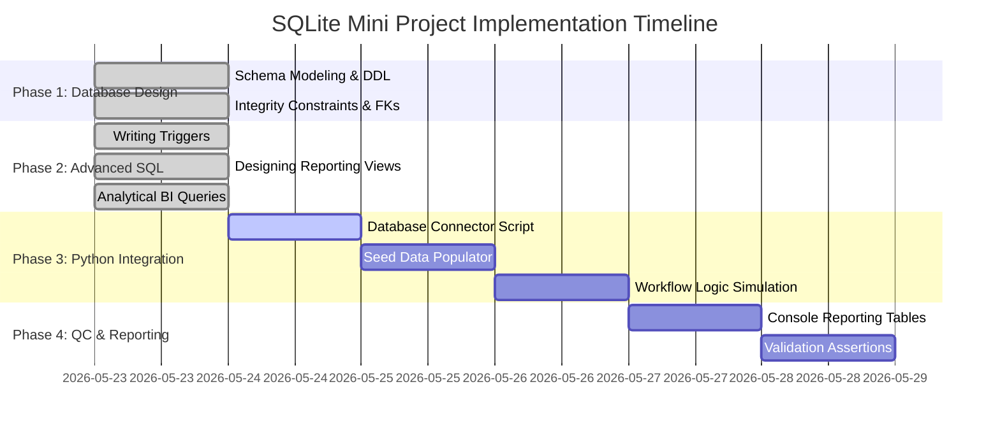

# Heritage Textile Intelligence & Supply Chain Management System
## DBMS Project Documentation

This document serves as the comprehensive design and architectural documentation for the **Heritage Textile Intelligence & Supply Chain Management System**. This SQLite-based relational database is designed to solve real-world tracking, authenticity, wage, and inventory problems in the traditional handloom industry.

---

## 1. Final Project Architecture Overview

Traditional heritage handloom textile production is highly fragmented, localized, and artisanal. Supply chains face issues such as raw material shortages, high defect rates, untracked artisan wages, lack of production visibility, and a growing market of counterfeit goods.

The **Heritage Textile Intelligence & Supply Chain Management System** is a unified relational database architecture that bridges these gaps.

```
       +--------------------------------------------------------+
       |                  CUSTOMER & ORDERS                     |
       |  [Customers] <1---M> [Customer Orders] <1---M> [Items] |
       +----------------------------+---------------------------+
                                    |
                                    v (Triggers Production)
       +----------------------------+---------------------------+
       |                  PRODUCTION LIFECYCLE                  |
       |  [Artisans] <1---M> [Production Batches] <M---1> [Looms]|
       |                            |                           |
       |           [Production Delays] (Tracks Bottlenecks)      |
       +----------------------------+---------------------------+
                                    |
            +-----------------------+-----------------------+
            |                       |                       |
            v                       v                       v
 +----------------------+  +---------------------+  +----------------------+
 |   QUALITY CONTROL    |  |    ARTISAN WAGES    |  |     AUTHENTICITY     |
 | [Inspections] <1--1> |  |   [Wage Payments]   |  | [Authenticity Recs]  |
 |     [Rework Logs]    |  |  (Auto-calculated & |  |  (Simulated Blockchain|
 | (For Failed Batches) |  |   Adjusted by QC)   |  |   Verification QR)   |
 +----------------------+  +---------------------+  +----------------------+
            ^
            | (Consumes Materials)
 +-------------------------------------------------------------------------+
 |                            INVENTORY & SUPPLY                           |
 |      [Suppliers] <1---M> [Supplier Materials] <M---1> [Materials]      |
 |                     [Inventory Alerts] (Low Stock Auto-alerts)          |
 +-------------------------------------------------------------------------+
```

### Module Design:
1. **Artisan Management:** Maintains details of weavers, skill levels (Beginner, Intermediate, Master), and base wage rates.
2. **Loom Management:** Tracks physical looms, types (Pit, Frame, Jacquard), maintenance intervals, and efficiency ratings.
3. **Design / Motif Management:** Catalogues heritage designs, regional origins, and complexity multipliers which directly scale artisan wages.
4. **Raw Material Inventory:** Tracks raw materials (yarns, dyes, zari), stock levels, quality grades, and sustainability features (natural vs synthetic dye, eco-friendliness).
5. **Supplier Management:** Logs suppliers and maps them to raw materials with lead times and prices (resolving M:N relationships).
6. **Production Tracking:** Captures the execution lifecycle of batches.
7. **Quality Control:** Manages inspections, defect details, and scores.
8. **Wage Payment Management:** Automatically calculates gross wages based on production output, complexity multipliers, and base wage rates, adjusting net wages based on QC feedback.
9. **Inventory Alert System:** Automatically monitors low stock levels and logs alerts for reorders.
10. **Authenticity Verification:** Generates unique certificates (QR url + SHA-256 hash) for verified completed textile batches.
11. **User / Role Management:** Manages accounts and roles (Admin, Inventory Manager, QC Inspector, Finance Manager).
12. **Customer & Order Management:** Handles customer purchases, deadlines, and item lines.
13. **Shipment Tracking:** Manages logistics, tracking numbers, carrier information, and delivery statuses.
14. **Rework & Defect Management:** Logs corrective actions for failed batches.
15. **Sustainability Metrics:** Aggregates and calculates eco-ratings based on material properties (natural dyes, organic status).

---

## 2. ER Relationship Explanation

The database design represents a highly interconnected normalized relational model. Key relationships include:

1. **Artisans to Production Batches (1:M):** An artisan can weave multiple production batches over time, but each batch is assigned to exactly one lead artisan. Managed by foreign key `artisan_id` in `production_batches`.
2. **Looms to Production Batches (1:M):** A loom can be utilized for multiple batches sequentially, but a batch is woven on one specific loom at a time. Managed by `loom_id` in `production_batches`.
3. **Designs to Production Batches (1:M):** A design can be reproduced in multiple production batches, but each batch is dedicated to weaving one design. Managed by `design_id` in `production_batches`.
4. **Suppliers to Raw Materials (M:N):** Multiple suppliers can supply the same raw material, and a single supplier can supply multiple raw materials. This relationship is decomposed into an associative table `supplier_materials` (Composite PK: `supplier_id`, `material_id`) to maintain 3NF.
5. **Production Batches to Raw Materials (M:N):** A production batch consumes multiple raw materials (e.g., silk yarn, natural dye), and a raw material can be used across multiple production batches. Normalised via `batch_material_usage` (Composite PK: `batch_id`, `material_id`).
6. **Production Batches to Production Delays (1:M):** A production batch can experience multiple delays (e.g., material shortage followed by loom breakdown). Managed by `batch_id` in `production_delays`.
7. **Production Batches to Inspections (1:M):** A production batch can undergo multiple quality inspections (especially if rework is required), though typically it undergoes at least one. Managed by `batch_id` in `inspections`.
8. **Inspections to Rework Logs (1:M / 1:1):** An inspection that results in "Rework Required" maps to a rework tracking entry. Managed by `inspection_id` in `rework_logs`.
9. **Production Batches to Wage Payments (1:1 / 1:M):** A production batch triggers a wage payment for the artisan. In our schema, it maps to one wage payment record per completed batch via `batch_id` in `wage_payments`.
10. **Production Batches to Authenticity Records (1:1):** A completed batch has exactly one authenticity record. Enforced by a `UNIQUE` constraint on `batch_id` in `authenticity_records`.
11. **Customers to Customer Orders (1:M):** A customer can place many orders, but each order belongs to one customer. Managed by `customer_id` in `customer_orders`.
12. **Customer Orders to Designs (M:N):** An order can contain multiple designs, and a design can be requested across multiple orders. Normalised via `order_items` (Composite PK: `order_id`, `design_id`).
13. **Customer Orders to Shipments (1:1):** An order has one shipment dispatch record. Enforced by `UNIQUE` constraint on `order_id` in `shipments`.

---

## 3. Trigger Design

Triggers represent the "Intelligence" layer of the database, automating business logic at the DBMS level without relying on application-level checks. This ensures data integrity.

*   **`tg_deduct_inventory_on_batch_start` (AFTER UPDATE of status on `production_batches`):**
    *   *Logic:* When a batch status changes to 'In Progress', it automatically deducts the required material quantities defined in `batch_material_usage` from `raw_materials.stock_quantity`.
    *   *Purpose:* Real-time inventory tracking.
*   **`tg_check_inventory_alert` (AFTER UPDATE of `stock_quantity` on `raw_materials`):**
    *   *Logic:* When a material's stock level is updated and falls below its `reorder_level`, it automatically inserts an active alert into `inventory_alerts` (if one does not already exist).
    *   *Purpose:* Automated reordering alerts.
*   **`tg_calculate_wage_on_completion` (AFTER UPDATE of status on `production_batches`):**
    *   *Logic:* When a batch's status is changed to 'Completed', it calculates the artisan's wage: $\text{Calculated Wage} = \text{quantity\_meters} \times \text{base\_wage\_rate} \times \text{complexity\_multiplier}$. It automatically inserts a 'Pending' payment record.
    *   *Purpose:* Instant wage processing based on output, skill, and design complexity.
*   **`tg_generate_authenticity_record` (AFTER UPDATE of status on `production_batches`):**
    *   *Logic:* When a batch is marked 'Completed', it generates a unique authenticity record including a custom serial number (`TX-YYYY-XXXX`), QR URL, and a simulated 32-byte SHA-256 blockchain transaction hash.
    *   *Purpose:* Anti-counterfeit provenance generation.
*   **`tg_apply_qc_wage_adjustment` (AFTER INSERT on `inspections`):**
    *   *Logic:*
        1. If inspection is 'Passed' and score $\ge 95.0$, updates the corresponding wage payment to add a 10% bonus.
        2. If inspection is 'Failed' or 'Rework Required', applies a 15% deduction to wages.
        3. If status is 'Rework Required', it automatically creates a new log entry in `rework_logs` detailing the instructions and assigning it back to the artisan.
    *   *Purpose:* Incentive/penalty-driven quality assurance and automatic defect loop routing.

---

## 4. Database Views

Views abstract complex joins and calculations, providing virtual tables for reporting:

1. **`vw_artisan_performance`:** Consolidates artisan output, average quality scores, total wages, and delay rates. Helpful for HR and performance reviews.
2. **`vw_sustainability_metrics`:** Computes environmental KPIs, including percentage of eco-friendly materials used, and the ratio of natural dyes to synthetic dyes. Helpful for sustainability compliance.
3. **`vw_active_supply_chain`:** Provides a live snapshot of active production batches, including loom utilization, time track, and outstanding delay counts.
4. **`vw_inventory_status`:** Integrates raw material stock levels, status labels ("Low Stock", "Out of Stock"), active alert states, and direct supplier contact details for rapid procurement.
5. **`vw_order_fulfillment_status`:** Connects customer orders with their fulfillment progress, metrics, and tracking statuses.

---

## 5. Complex SQL Queries

These analytical queries are designed to demonstrate high-level business intelligence.

### Query 1: Artisan Efficiency and Variance Analysis
This query compares estimated production days against actual days taken to complete batches, calculating the performance variance to identify master weavers and workflow bottlenecks.
```sql
SELECT 
    a.artisan_id,
    a.first_name || ' ' || a.last_name AS artisan_name,
    d.design_name,
    COUNT(b.batch_id) AS completed_batches,
    ROUND(AVG(d.estimated_production_days), 1) AS avg_estimated_days,
    ROUND(AVG(JULIANDAY(b.actual_completion_date) - JULIANDAY(b.start_date)), 1) AS avg_actual_days,
    ROUND(AVG((JULIANDAY(b.actual_completion_date) - JULIANDAY(b.start_date)) - d.estimated_production_days), 1) AS avg_days_variance
FROM artisans a
JOIN production_batches b ON a.artisan_id = b.artisan_id
JOIN designs d ON b.design_id = d.design_id
WHERE b.status = 'Completed'
GROUP BY a.artisan_id, d.design_id
ORDER BY avg_days_variance ASC;
```

### Query 2: Supply Chain Delay and Bottleneck Analysis
Aggregates production delays by category, calculating the total duration of active delays and identifying the primary causes of supply chain disruptions.
```sql
SELECT 
    pd.reason_category,
    COUNT(pd.delay_id) AS total_delay_incidents,
    SUM(CASE 
        WHEN pd.resolved_date IS NOT NULL THEN (JULIANDAY(pd.resolved_date) - JULIANDAY(pd.start_date))
        ELSE (JULIANDAY('now') - JULIANDAY(pd.start_date))
    END) AS total_delay_days,
    ROUND(AVG(CASE 
        WHEN pd.resolved_date IS NOT NULL THEN (JULIANDAY(pd.resolved_date) - JULIANDAY(pd.start_date))
        ELSE (JULIANDAY('now') - JULIANDAY(pd.start_date))
    END), 1) AS avg_delay_duration_days
FROM production_delays pd
GROUP BY pd.reason_category
ORDER BY total_delay_days DESC;
```

### Query 3: Authenticity & Heritage Story Query (QR Code Lookup)
Retrieves the complete historical pedigree of a textile product via its verification code. This provides the consumer with the full heritage story.
```sql
SELECT 
    ar.verification_code,
    d.design_name AS motif_name,
    d.regional_origin,
    d.cultural_significance,
    a.first_name || ' ' || a.last_name AS master_artisan,
    a.experience_years || ' years' AS artisan_experience,
    l.loom_type AS weaving_loom,
    b.actual_completion_date AS completion_date,
    i.quality_score AS certified_quality,
    GROUP_CONCAT(rm.material_name || ' (' || rm.dye_type || ' Dye)', ', ') AS raw_materials_used,
    ar.blockchain_hash AS authenticity_proof
FROM authenticity_records ar
JOIN production_batches b ON ar.batch_id = b.batch_id
JOIN designs d ON b.design_id = d.design_id
JOIN artisans a ON b.artisan_id = a.artisan_id
JOIN looms l ON b.loom_id = l.loom_id
LEFT JOIN inspections i ON b.batch_id = i.batch_id AND i.status = 'Passed'
LEFT JOIN batch_material_usage bmu ON b.batch_id = bmu.batch_id
LEFT JOIN raw_materials rm ON bmu.material_id = rm.material_id
WHERE ar.verification_code = 'TX-2026-0001' -- Example code
GROUP BY ar.verification_code;
```

### Query 4: Financial Ledger & Profitability Analysis
Computes the material and labor costs vs the sale price for each production batch, determining the net profit margin per design.
```sql
SELECT 
    b.batch_id,
    d.design_name,
    b.quantity_meters AS quantity_meters_produced,
    -- Calculate raw material cost
    ROUND(COALESCE(SUM(bmu.quantity_used * rm.cost_per_unit), 0.0), 2) AS material_cost,
    -- Calculate wage cost (from wage_payments)
    ROUND(wp.net_wage, 2) AS labor_cost,
    ROUND(COALESCE(SUM(bmu.quantity_used * rm.cost_per_unit), 0.0) + wp.net_wage, 2) AS total_production_cost,
    -- Calculate estimated revenue (based on average unit sales price in order_items)
    ROUND(b.quantity_meters * COALESCE((
        SELECT AVG(unit_price) 
        FROM order_items 
        WHERE design_id = d.design_id
    ), d.complexity_multiplier * 1500.0), 2) AS estimated_revenue,
    -- Calculate net profit
    ROUND((b.quantity_meters * COALESCE((
        SELECT AVG(unit_price) 
        FROM order_items 
        WHERE design_id = d.design_id
    ), d.complexity_multiplier * 1500.0)) - (COALESCE(SUM(bmu.quantity_used * rm.cost_per_unit), 0.0) + wp.net_wage), 2) AS net_profit
FROM production_batches b
JOIN designs d ON b.design_id = d.design_id
LEFT JOIN batch_material_usage bmu ON b.batch_id = bmu.batch_id
LEFT JOIN raw_materials rm ON bmu.material_id = rm.material_id
LEFT JOIN wage_payments wp ON b.batch_id = wp.batch_id
WHERE b.status = 'Completed'
GROUP BY b.batch_id;
```

---

## 6. Normalization (1NF, 2NF, 3NF)

To ensure high data integrity, the schema has been strictly normalized up to the Third Normal Form (3NF).

### First Normal Form (1NF)
*   **Definition:** All attributes contain only atomic (indivisible) values, and there are no repeating groups.
*   **Application:**
    *   Instead of storing multiple materials in a single comma-separated text column in `production_batches`, we created the `batch_material_usage` table.
    *   Instead of listing multiple items in a single text field in `customer_orders`, we created the `order_items` table.
    *   Artisan names are separated into `first_name` and `last_name`.

### Second Normal Form (2NF)
*   **Definition:** Meets 1NF, and all non-key attributes are fully functionally dependent on the entire primary key (no partial dependencies on a composite key).
*   **Application:**
    *   In the composite key associative table `supplier_materials(supplier_id, material_id)`, non-key attributes like `supply_lead_time_days` and `unit_price` depend on the *combination* of both the supplier and the material, not just one.
    *   In `order_items(order_id, design_id)`, the `quantity_meters` and `unit_price` are fully dependent on both the order and the design being purchased. No design details (like `regional_origin`) are in this table, preventing partial dependency.

### Third Normal Form (3NF)
*   **Definition:** Meets 2NF, and there are no transitive dependencies (non-key attributes do not depend on other non-key attributes).
*   **Application:**
    *   In `production_batches`, we store `artisan_id`, `loom_id`, and `design_id`. We do *not* store the artisan's name, the loom's efficiency, or the design's complexity multiplier in this table. Those details belong strictly in `artisans`, `looms`, and `designs` respectively.
    *   If we stored the complexity multiplier directly in `production_batches`, it would create a transitive dependency: `batch_id -> design_id -> complexity_multiplier`. If the complexity multiplier changed, we would have data anomalies. By referencing `design_id` and fetching the multiplier via a join (or in triggers), we maintain 3NF.
    *   In `inspections`, we store `inspector_id` (pointing to `users.user_id`). The inspector's role and email are kept in the `users` table, preventing the transitive dependency `inspection_id -> inspector_id -> email`.

---

## 7. Professional Folder Structure

```
heritage-textile-tracker/
│
├── database/
│   ├── schema.sql            # Core SQLite DDL script (tables, triggers, views)
│   └── heritage_tracker.db   # Generated SQLite database file
│
├── docs/
│   └── project-notes.md      # This architectural design documentation
│
├── src/
│   ├── __init__.py           # Package marker
│   └── main.py               # Complete Python workflow simulation & verification script
│
├── README.md                 # Project summary and quick start guide
└── requirements.txt          # Python dependencies (standard library only)
```

---

## 8. Implementation Roadmap



1.  **Step 1: Schema Initialization:** Run `schema.sql` against the SQLite engine to set up all objects. (Completed)
2.  **Step 2: Python Scripting (`main.py`):** Write code to connect to SQLite, populate seed data, run transactions representing production lifecycles, and check if triggers execute successfully.
3.  **Step 3: Verification:** Verify that low-stock alerts, wage payments, and authenticity records are automatically created as state transitions occur.
4.  **Step 4: Analytical Reporting:** Run the 4 complex queries to output performance, delay, genealogy, and financial reports.
